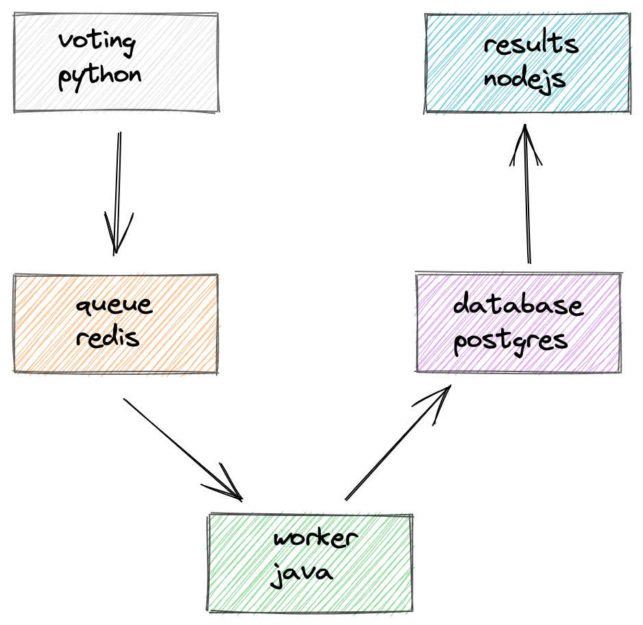

Broken?
=======

Hello, we broke this application in a couple ways. Can you help us fix it?

Super Voting App
=========

A simple distributed application running across multiple Docker containers.

Getting started
---------------

Open in Gitpod.

## Linux Containers

The Linux stack uses Python, Node.js, Java, with Redis for messaging and Postgres for storage.

Run in this directory:
```
docker-compose up
```
The app will be running at [http://localhost:5000](http://localhost:5000), and the results will be at [http://localhost:5001](http://localhost:5001).

Architecture
-----



* A front-end web app in [Python](/vote) which lets you vote between two options
* A [Redis](https://hub.docker.com/_/redis/) queue which collects new votes
* A [Java](/worker/src/main) worker which consumes votes and stores them in…
* A [Postgres](https://hub.docker.com/_/postgres/) database backed by a Docker volume
* A [Node.js](/result) webapp which shows the results of the voting in real time


Notes
-----

The voting application only accepts one vote per client. It does not register votes if a vote has already been submitted from a client.

This isn't an example of a properly architected perfectly designed distributed app...
it's just a simple example of the various types of pieces and languages you might see
(queues, persistent data, etc), and how to deal with them in Docker at a basic level. 
